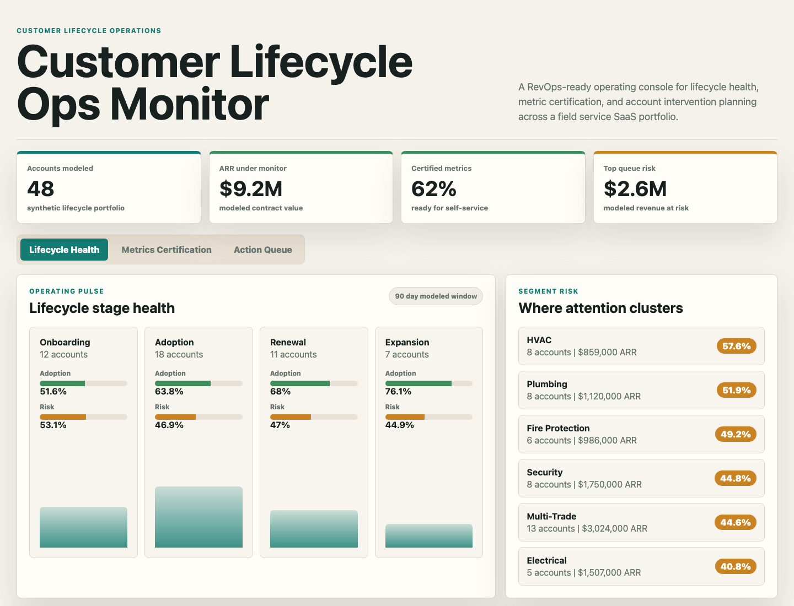
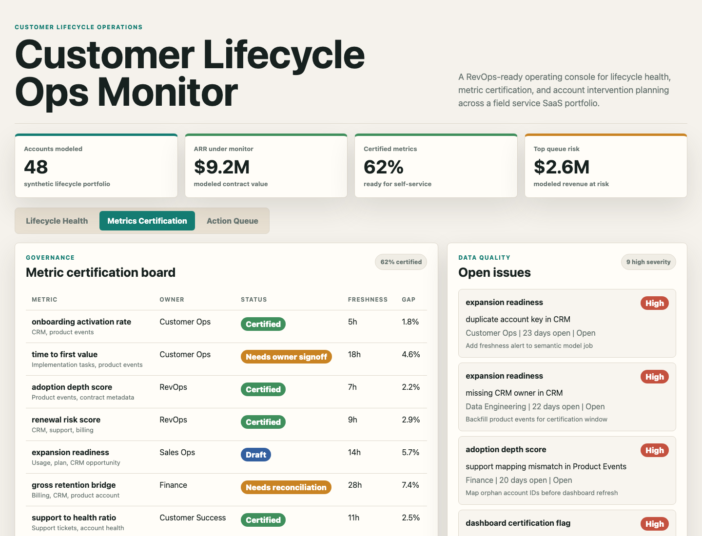
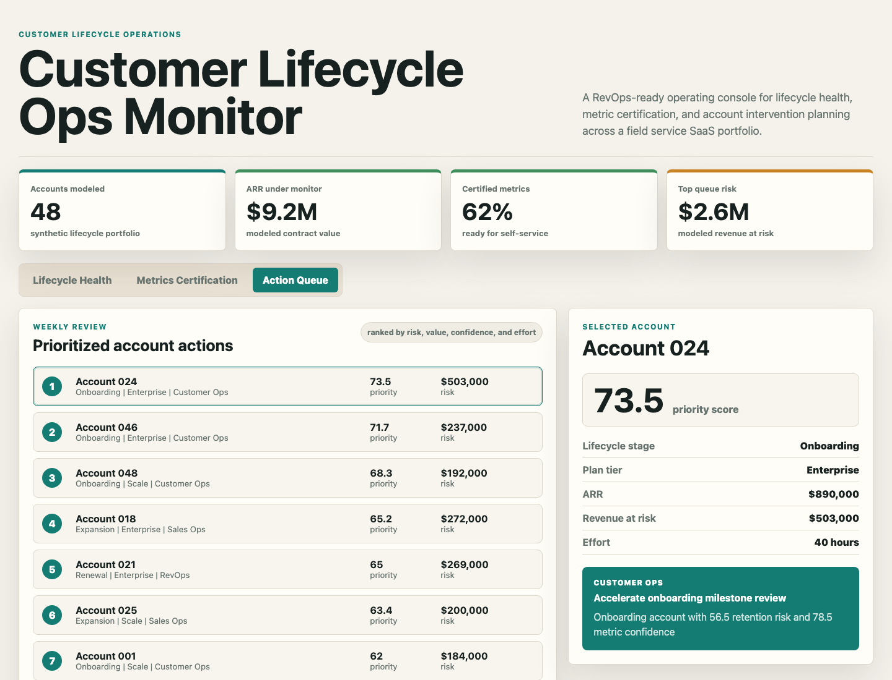

# Customer Lifecycle Ops Monitor

This portfolio artifact models a customer operations analytics workflow for a multi-brand field service SaaS business. It focuses on the practical RevOps problem behind lifecycle reporting: teams need trusted customer metrics before dashboards can drive onboarding, adoption, renewal, and expansion decisions.

The project is a static, browser-ready operating console backed by synthetic lifecycle data, metric certification logic, SQL checks, and a Python scoring script.

## Screenshots



**Lifecycle Health:** Shows the executive operating pulse across lifecycle stages, ARR under monitor, certified metric coverage, top queue risk, adoption, retention risk, and segment concentration.



**Metrics Certification:** Tracks metric owners, source systems, definition status, freshness, reconciliation gaps, and data quality incidents that block trusted self-service reporting.



**Action Queue:** Converts lifecycle signals into a ranked weekly review queue with owner, priority score, modeled revenue at risk, effort, and recommended next action.

## What This Demonstrates

- SQL-oriented lifecycle analysis across account, daily metric, certification, and data quality tables.
- BI dashboard thinking that goes beyond KPI display by showing metric trust, source-system issues, and action ownership.
- RevOps communication, including a concise executive readout and a queue that customer-facing teams can use in operating reviews.
- Data documentation and scope control suitable for a role that partners with Customer Operations, Finance, Sales Ops, RevOps, and Data Engineering.

## Data

All data is synthetic and generated by `scripts/score_operating_data.py` with a fixed random seed. It does not represent any real company, customer, or performance history.

The synthetic structure models a field service SaaS customer lifecycle portfolio:

- 48 customer accounts across field service industries, regions, plan tiers, and lifecycle stages.
- 4,320 daily metric rows over a 90 day modeled window.
- 8 governed lifecycle metric definitions with owners, source systems, freshness, reconciliation gaps, and certification status.
- 36 data quality incidents across CRM, product events, billing, support, and semantic model sources.
- 48 recommended account actions scored by retention risk, adoption gap, metric confidence gap, ARR, and effort.

Generation assumptions:

- ARR ranges vary by plan tier.
- Adoption and retention risk are negatively correlated.
- Metric confidence affects action priority because low-trust reporting should not be scaled blindly.
- Billing, CRM, product event, support, and semantic model joins are treated as common places where lifecycle reporting breaks.
- Priority scoring balances risk, commercial value, data confidence, and estimated operational effort.

## Repository Structure

- `index.html`: Static app shell.
- `src/app.js`: Dashboard rendering, tabs, scoring display, and selected account detail.
- `src/data.js`: Generated dashboard-ready data.
- `src/styles.css`: Responsive console styling.
- `data/`: Synthetic CSV marts.
- `analysis/sql_checks.sql`: SQL examples for lifecycle health, metric certification, data quality backlog, and weekly action queue.
- `analysis/executive_findings.md`: Stakeholder-ready findings.
- `analysis/analysis_plan.md`: Analytical plan and workflow.
- `scripts/score_operating_data.py`: Synthetic data generator and priority scoring script.

## Run Locally

```bash
python3 -m http.server 4173
```

Then open `http://localhost:4173`.

To regenerate the synthetic data and dashboard payload:

```bash
python3 scripts/score_operating_data.py
```

## Scope

This project does create a realistic portfolio artifact for lifecycle operations analytics, metric certification, and customer-facing action planning.

This project does not connect to a live warehouse, use real customer data, replace a production semantic layer, or claim to measure any actual business performance.
