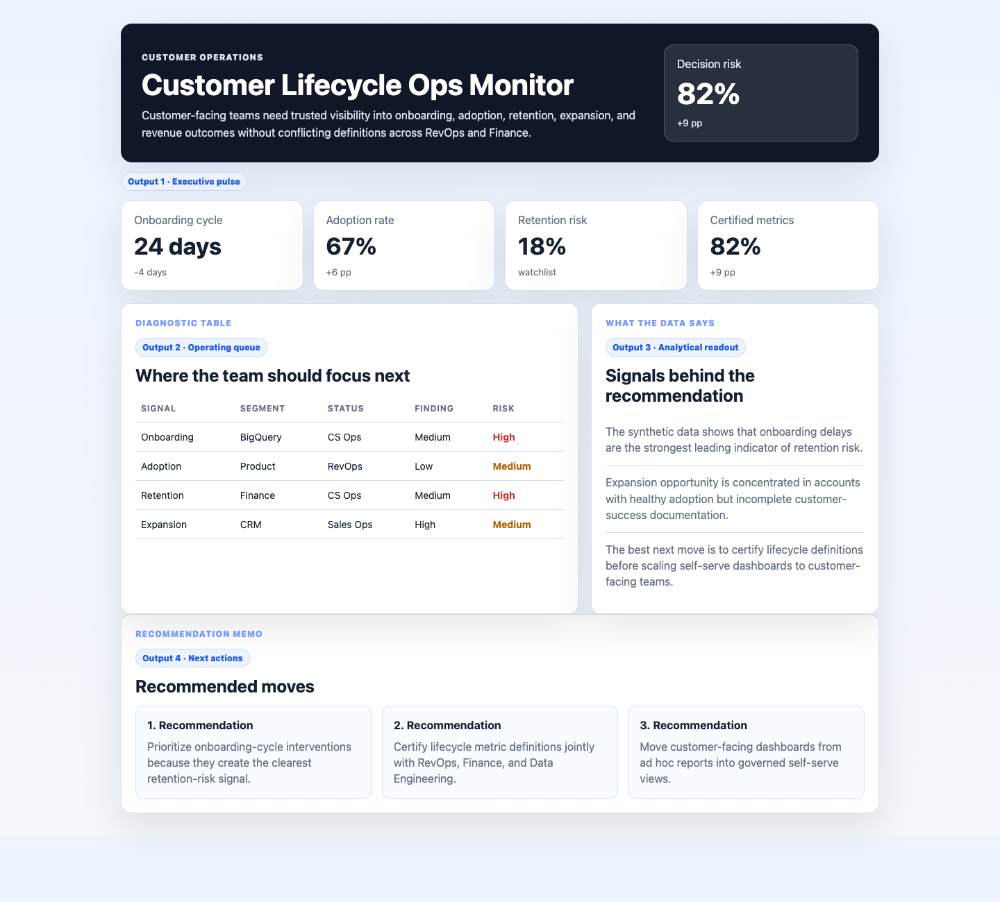

# Customer Lifecycle Ops Monitor

I built this because customer operations analytics needs to reduce reporting noise while preserving metric trust. The project models how RevOps, customer operations, finance, and data engineering can align on lifecycle metrics, dashboard certification, and customer-facing operating signals.



## Why this exists

Customer-facing teams need trusted visibility into onboarding, adoption, retention, expansion, and revenue outcomes without conflicting definitions across RevOps and Finance.

## What is in the project

- A polished dashboard in `index.html`
- Modular UI/data files in `src/`
- Synthetic operating data in `data/synthetic_operating_data.csv`
- A screenshot captured from the rendered app in `docs/images/dashboard.png`

## Dashboard sections

- Lifecycle pulse: onboarding cycle time, adoption rate, retention risk, and expansion pipeline.
- Metric certification table: owner, system source, definition quality, and reporting risk.
- Operations memo: dashboard cleanup, BigQuery model checks, and lifecycle intervention priorities.

## What the data says

The synthetic data shows that onboarding delays are the strongest leading indicator of retention risk.

Expansion opportunity is concentrated in accounts with healthy adoption but incomplete customer-success documentation.

The best next move is to certify lifecycle definitions before scaling self-serve dashboards to customer-facing teams.

## Output walkthrough

### Output 1: Executive pulse

The KPI cards summarize the current operating picture and highlight whether the team should trust, investigate, or act on the latest metrics.

### Output 2: Diagnostic table

The table converts raw operating signals into a ranked queue of risks, owners, and recommended next actions.

### Output 3: Analytical recommendations

The memo turns the analysis into specific business actions that can be discussed in a weekly review or stakeholder workshop.

## Run locally

```bash
python3 -m http.server 4173
```

Then open `http://localhost:4173`.
